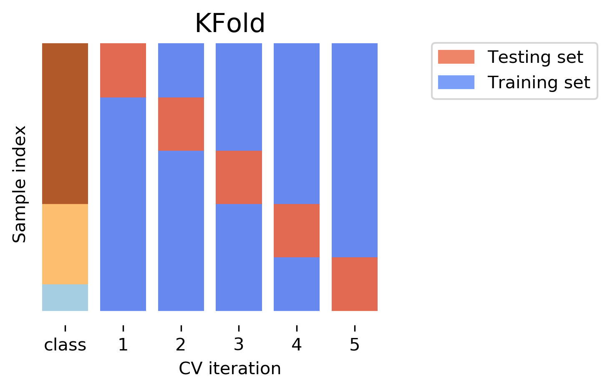
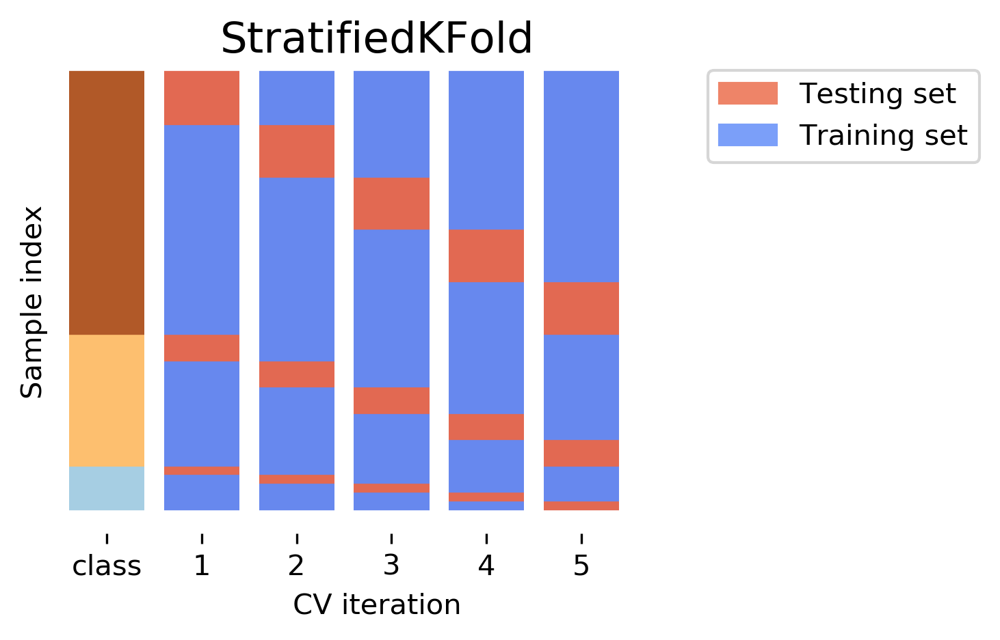
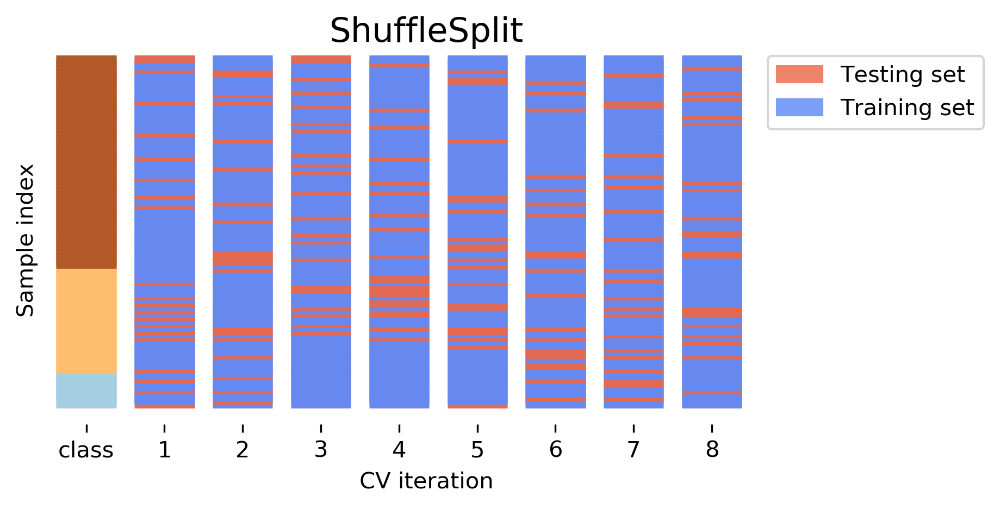
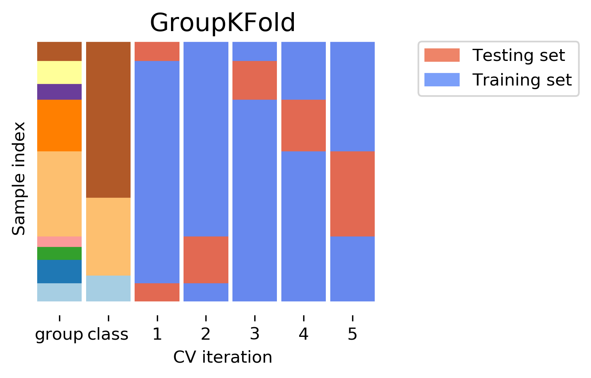
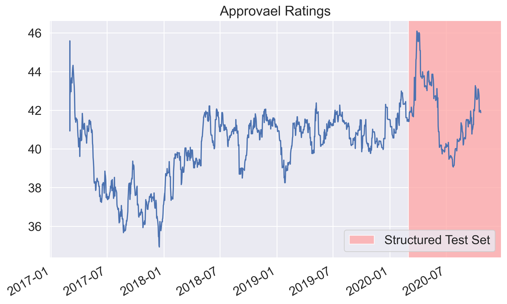
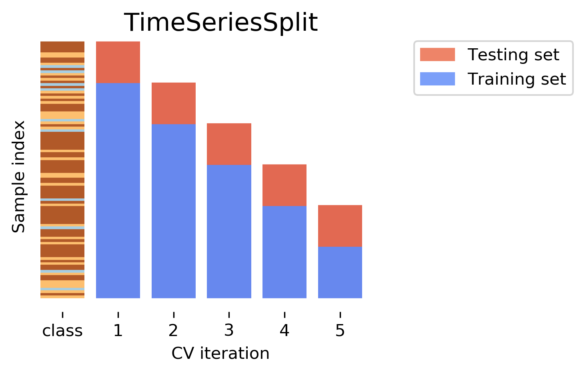
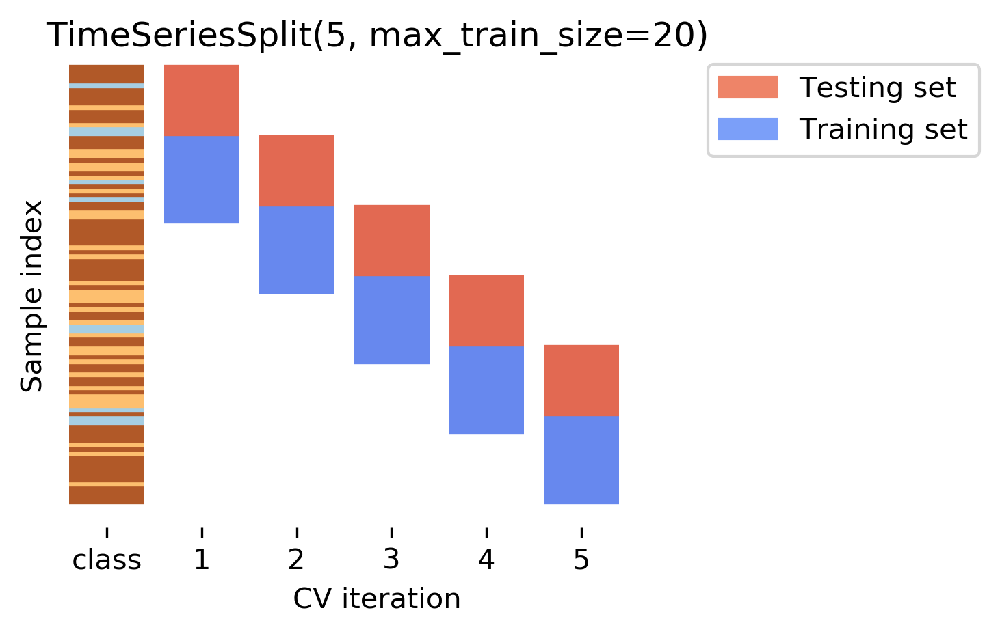
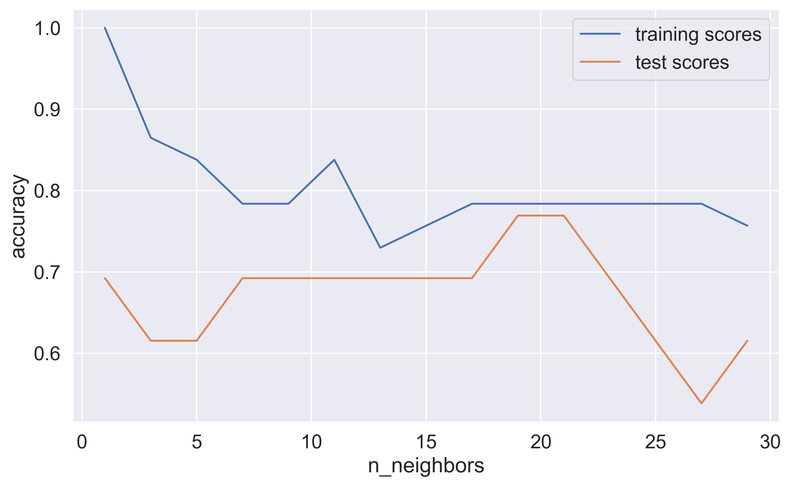
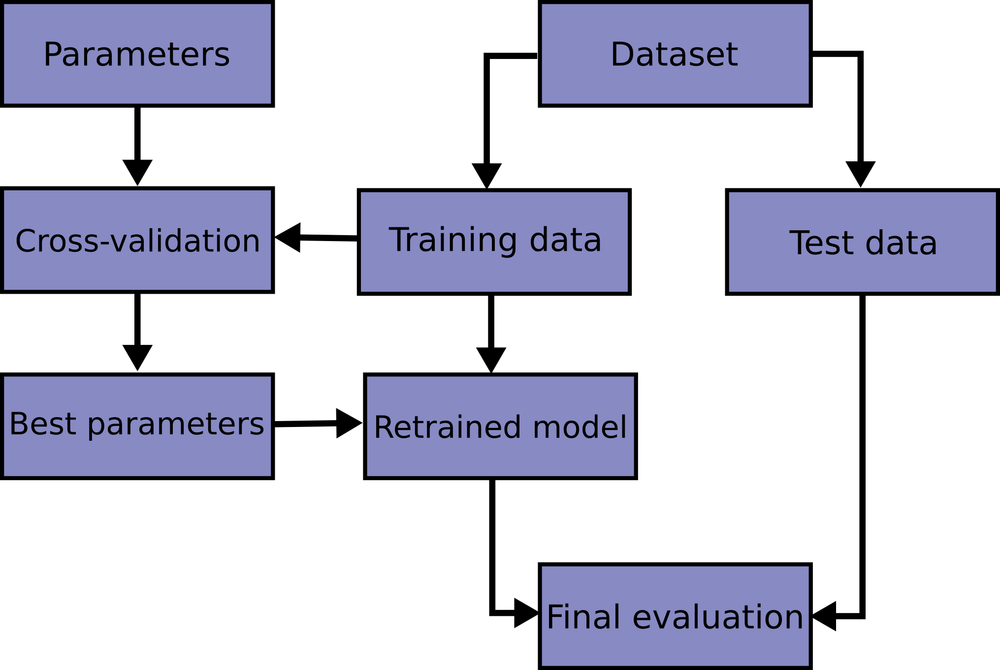

title: Intermediate Machine Learning with scikit-learn: Cross validation, Parameter Tuning, Pandas Interoperability, and Missing Values
use_katex: True
class: title-slide

# Intermediate Machine Learning with scikit-learn
## Cross validation, Parameter Tuning, Pandas Interoperability, and Missing Values


.larger[Thomas J. Fan]<br>
@thomasjpfan<br>
<a href="https://www.github.com/thomasjpfan" target="_blank"><span class="icon icon-github icon-left"></span></a>
<a href="https://www.twitter.com/thomasjpfan" target="_blank"><span class="icon icon-twitter"></span></a>
<a class="this-talk-link", href="https://github.com/thomasjpfan/ml-workshop-intermediate-1-of-2" target="_blank">
This workshop on Github: github.com/thomasjpfan/ml-workshop-intermediate-1-of-2</a>

---

name: table-of-contents
class: title-slide, left

# Table of Contents
.g[
.g-6[
1. [Cross Validation](#validation)
1. [Parameter Tuning](#parameter-tuning)
1. [Pandas Interoperability](#pandas)
1. [Missing Values](#missing-values)
]
.g-6.g-center[

]
]

---

# Scikit-learn API

.center[
## `estimator.fit(X, [y])`
]

.g[
.g-6[
## `estimator.predict`
- Classification
- Regression
- Clustering
]
.g-6[
## `estimator.transform`
- Preprocessing
- Dimensionality reduction
- Feature selection
- Feature extraction
]
]

---

# Data Representation


---

# Supervised ML Workflow


---

class: chapter-slide

# Notebook 📒!
## notebooks/00-review-sklearn.ipynb

---

name: validation
class: chapter-slide

# 1. Cross Validation

.footnote-back[
[Back to Table of Contents](#table-of-contents)
]

---

# Single train test split


---

# Three Fold Split


---

# Why cross validate?


---

# Why cross validate?


---

# Can we do better?


---

class: chapter-slide

# Notebook 📓!
## notebooks/01-cross-validation.ipynb

---

class: chapter-slide

# Cross Validation Strategies

---



---



---



---


---

# Strategies for increasing the number of folds

- High variance, takes a long time
```py
from sklearn.model_selection import LeaveOneOut
```

- `ShuffleSplit` with stratification
```py
from sklearn.model_selection import StratifiedShuffleSplit
```

- Repeat `KFold` or `StratifiedKFold`
```py
from sklearn.model_selection import RepeatedKFold
from sklearn.model_selection import RepeatedStratifiedKFold
```

---

# Cross-validation with non-idd data

## Grouped data

- Assume data is not iid such as patient ID or user id
- We want to generalized to a new patient

## Time Series

- Data is correlated

---



---


---


---



---



---



---

class: chapter-slide

# Notebook 📓!
## notebooks/01-cross-validation.ipynb

---

name: parameter-tuning
class: chapter-slide

# 2. Parameter Tuning

.footnote-back[
[Back to Table of Contents](#table-of-contents)
]

---

class: center

# What Tune Parameters?


---

# Score vs n_neighbors



---

# Parameter Tuning Workflow



---

# GridSearchCV

```py
from sklearn.model_selection import GridSearchCV

param_grid = {'n_neighbors': np.arange(1, 30, 2)}
grid = GridSearchCV(KNeighborsClassifier(), param_grid=param_grid,
                    return_train_score=True)

grid.fit(X_train, y_train)
```

Best score

```py
grid.best_score_
```

Best parameters

```py
grid.best_params_
```

---

# RandomSearchCV


---

# Random Search with scikit-learn

```py
from scipoy.stats import randint
param_dist = {"max_depth": [3, None],
              "max_features": randin(1, 11)}

random_search = RandomizedSearchCV(
    clf, param_distributions=param_dist,
    n_iter=200)
```

---

class: chapter-slide

# Notebook 📓!
## notebooks/02-parameter-tuning.ipynb

---

name: pandas
class: chapter-slide

# 3. Pandas Interoperability

.footnote-back[
[Back to Table of Contents](#table-of-contents)
]

???

- Introduce heterogenous data
- categorical encoding
- column transformer
- notebook

---

name: missing-values
class: chapter-slide

# 4. Missing Values

.footnote-back[
[Back to Table of Contents](#table-of-contents)
]

???

- imputers
- simple ones
- knn based
- notebook

---

class: title-slide, left

# Closing

.g.g-middle[
.g-7[

1. [Cross Validation](#validation)
1. [Parameter Tuning](#parameter-tuning)
1. [Pandas Interoperability](#pandas)
1. [Missing Values](#missing-values)
]
.g-5.center[
<br>
.larger[Thomas J. Fan]<br>
@thomasjpfan<br>
<a href="https://www.github.com/thomasjpfan" target="_blank"><span class="icon icon-github icon-left"></span></a>
<a href="https://www.twitter.com/thomasjpfan" target="_blank"><span class="icon icon-twitter"></span></a>
<a class="this-talk-link", href="https://github.com/thomasjpfan/ml-workshop-intermediate-1-of-2" target="_blank">
This workshop on Github: github.com/thomasjpfan/ml-workshop-intermediate-1-of-2</a>
]
]
